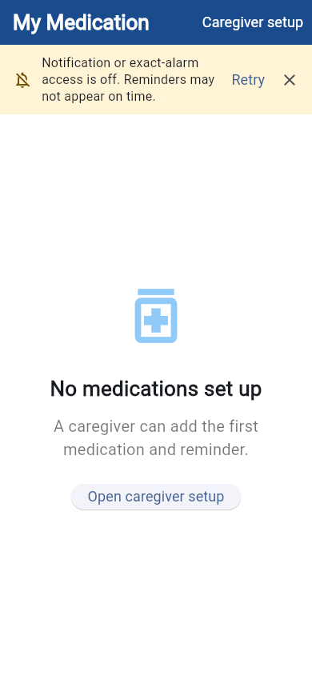
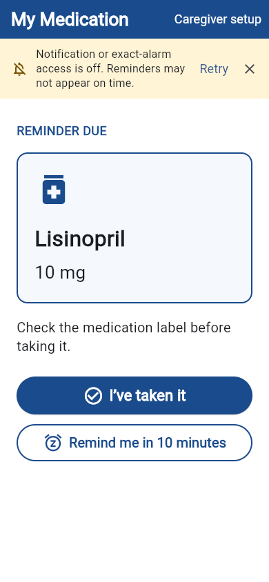

# MedMinder

MedMinder is a lightweight, caregiver-assisted Android prototype for medication reminders. A caregiver enters the medication name, dosage, and daily reminder time. The patient-facing screen then focuses on one question: **what medication is next?**

This project was created as an educational student project. It is accessibility-informed, but it has not been validated with people who have dementia.

| Empty patient screen | Reminder due |
|---|---|
|  |  |

## Important safety boundary

MedMinder is not a medical device and does not provide medical advice. It cannot verify that a medication was taken, guarantee that a reminder will arrive, or replace help from a caregiver or healthcare professional.

- “I’ve taken it” records that the user tapped an acknowledgement button. It does not verify ingestion.
- The app does not advise what to do about late or missed doses.
- Medication details should be entered from the label or instructions supplied by a healthcare professional.
- Android permissions, battery settings, device configuration, and operating-system behavior can delay or prevent notifications.

## Current experience

### Patient screen

- Shows one next, due, overdue, or snoozed medication.
- Uses large text, high contrast, plain language, and large tap targets.
- Enables **I’ve taken it** and **Remind me in 10 minutes** only when today’s reminder is due or overdue.
- Keeps schedule editing and deletion off the patient screen.

### Caregiver setup

- Adds medications with a name, dosage, and daily reminder time.
- Shows the full medication schedule.
- Deletes medications only after confirmation.
- Stores all data locally on the device.

The caregiver area is visually separated but is not protected by an account, PIN, or biometric check in this prototype.

## Architecture

The project intentionally remains small:

```text
lib/main.dart
  Patient and caregiver screens, navigation, and interaction state

lib/medication_state.dart
  Medication model, SharedPreferences persistence, migration,
  acknowledgements, snoozes, and next-occurrence selection

lib/notification_service.dart
  Android notification initialization, daily reminders, snoozes,
  cancellation, and cancellation retry
```

There is no server, database, account system, analytics service, or cloud synchronization. `SharedPreferences` stores medications and small acknowledgement/snooze records as JSON on the device.

## Requirements

- Flutter with a Dart SDK compatible with `^3.12.2`
- Android development tools and an Android emulator or physical device
- Notification permission on Android 13+
- Exact-alarm access where required by the Android version/device

The reminder implementation is Android-first. The repository contains Flutter-generated folders for other platforms, but their reminder behavior is not supported or verified.

## Run locally

```bash
flutter pub get
flutter run
```

Use fictional medication information during development and demonstrations.

## Verify changes

```bash
flutter analyze
flutter test
```

Manual Android verification should record:

- Device model and Android API level
- Whether notification and exact-alarm permissions are granted
- A daily reminder firing while the app is closed
- A ten-minute snooze firing
- Restart behavior after acknowledgement and snooze
- Permission-denied behavior
- Large system text and a narrow screen

Exact timing across untested Android vendors, power modes, timezone changes, and daylight-saving transitions is not claimed.

## Data behavior

- Acknowledgements are keyed by medication and scheduled local date.
- Future occurrences cannot be acknowledged early.
- An unacknowledged occurrence expires from the patient screen at local midnight without being labelled “missed.”
- One active snooze is allowed per medication occurrence.
- Old acknowledgement and snooze records are pruned because long-term adherence history is outside this project.
- Existing medication records missing a safe notification ID are migrated once to a stable local ID.

SharedPreferences and Android notification scheduling are not transactional. A process crash at exactly the wrong moment can leave an extra notification. The app retries known cancellation failures, but this remains an educational prototype rather than a production reminder system.

## Out of scope

- Medical advice, medication lookup, drug interactions, or dosage recommendations
- Remote caregiver monitoring or alerts
- Accounts, authentication, or cloud backup
- Long-term adherence reports or percentages
- Pharmacy, clinician, or health-record integrations
- Production release signing or app-store distribution
- Claims of clinical effectiveness or validated dementia usability

## Design sources

The interaction and limitations were informed by:

- [National Institute on Aging: common medical problems in Alzheimer’s disease](https://www.nia.nih.gov/health/alzheimers-caregiving/common-medical-problems-alzheimers-disease-information-caregivers)
- [Alzheimer’s Society: taking medications with dementia](https://www.alzheimers.org.uk/about-dementia/treatments/dementia-medication/taking-dementia-medications)
- [W3C: ensure processes do not rely on memory](https://www.w3.org/WAI/WCAG2/supplemental/objectives/o6-memory/)
- [Apple: medication reminders and logging](https://support.apple.com/en-us/105064)

## Project ownership

Changes to the caregiver-assisted direction should be reviewed by the student owner before merge. A draft pull request is a proposal, not a decision to release or rely on the app.
